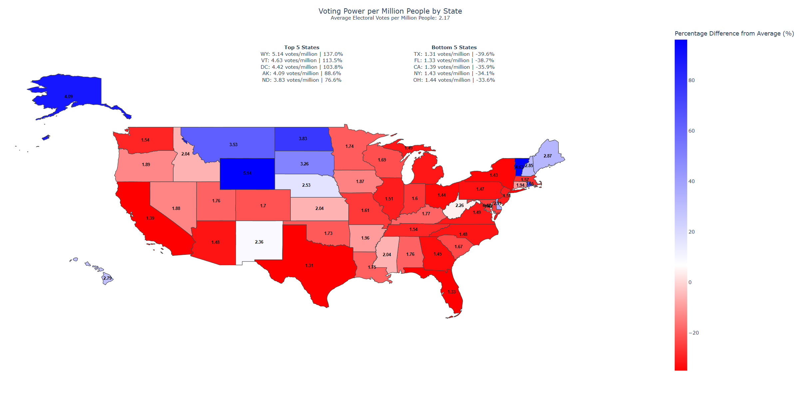

# Electoral College Voting Power Analysis

## Project Overview

This project aims to analyze the voting power of each state in the United States based on the Electoral College system. The purpose is to highlight the discrepancies in voting power depending on the state in which a voter resides, demonstrating how this system contradicts the philosophy of "one person, one vote."

## Project Objectives

- **Quantify Voting Power**: Calculate the voting power of each state's citizens based on their electoral votes and population.
- **Visualize Discrepancies**: Create visualizations to clearly illustrate the differences in voting power among states.
- **Discuss Implications**: Provide an analysis of how these discrepancies impact democratic principles and election outcomes.

## Dataset

### Sources
- **Population Data**: [United States Census Bureau](https://www2.census.gov/programs-surveys/popest/datasets/2020-2023/state/totals/NST-EST2023-ALLDATA.csv)
- **Electoral Votes**: [National Archives and Records Administration](https://www.archives.gov/electoral-college/allocation)

### Description
- **Population Data**: Contains the latest population estimates for each state.
- **Electoral Votes**: Contains the number of electoral votes allocated to each state.

### Visualization Example

Here is an example of the voting power distribution across the United States:



## How to Use this Project

### Prerequisites
- **Python**: Version 3.x
- **Libraries**: pandas, bs4, requests, geopandas, plotly.express, json, shapely.geometry, shapely.affinity

### Installation
1. Clone the repository:
    ```bash
    git clone https://github.com/mwheelermba/Michael-Wheeler-Portfolio.git
    cd Michael-Wheeler-Portfolio/Project-ElectoralCollegeVotingPower
    ```
2. Install required libraries:
    ```bash
    pip install pandas, bs4, requests, geopandas, plotly.express, json, shapely.geometry, shapely.affinity
    ```

### Running the Analysis
1. Open the Jupyter notebook `ElectoralCollegeVotingPower_Analysis.ipynb`.
2. Run all cells to perform the analysis and generate visualizations.

## Contact

Feel free to reach out if you have any questions or suggestions!

- **Email**: mikewheeler.ind@gmail.com
- **LinkedIn**: [linkedin.com/in/mwheelermba](https://linkedin.com/in/mwheelermba)
- **GitHub**: [github.com/mwheelermba](https://github.com/mwheelermba)
